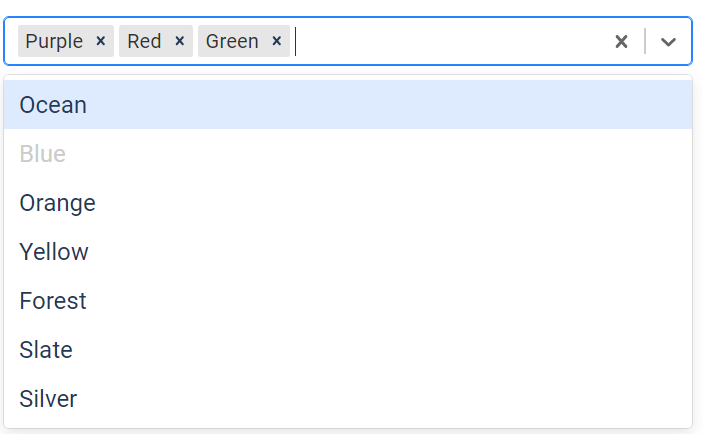

## reactpy-select

A minimal component wrapper for [react-select].
 
## Usage

    pip install reactpy-select

## TODO/DONE

- [X] multi-select support
- [X] theme support
- [X] custom styling support
- [X] placeholder
- [X] isClearable, isDisabled, isSearchable
- [X] Dash Add Ticker example 
- [ ] Fix Vite/Rollup export regex incompatibility (reactpy\web\utils.py#L148)
- [ ] Rework my reactpy-cookiecutter to use Vite

## Documentation

The [Plotly/Dash] project has an extensive [Dash Core Components] library. I can
see that ReactPy would befit form a similar library. The 
library's [dcc.Dropdown] component is a wrapper for [react-select]

### [Custom Styling]

[react-select] uses a callback mechanism to allow styles to be 
customized, see [Adjusting the Styling]. 

[Adjusting the Styling]: https://react-select.com/components#adjusting-the-styling
[Dash Core Components]: https://dash.plotly.com/dash-core-components
[Plotly/Dash]: https://dash.plotly.com/
[react-select]: https://react-select.com/home
[dcc.Dropdown]: https://dash.plotly.com/dash-core-components/dropdown